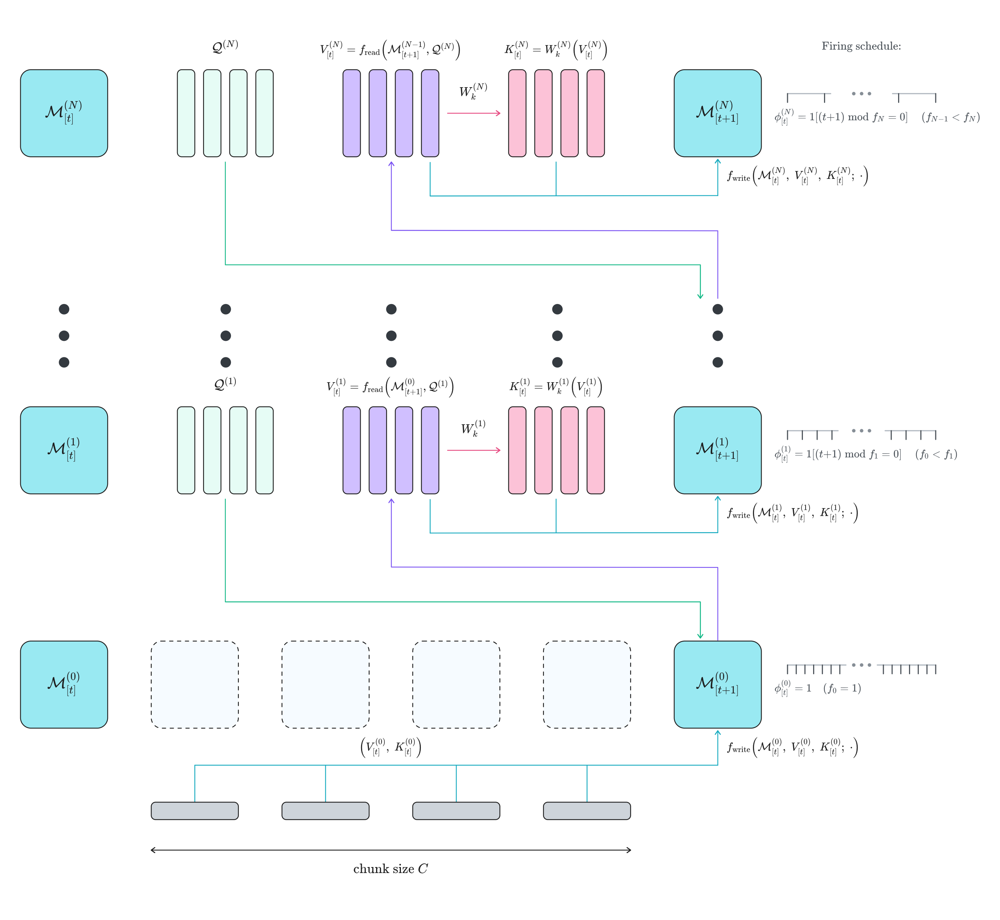
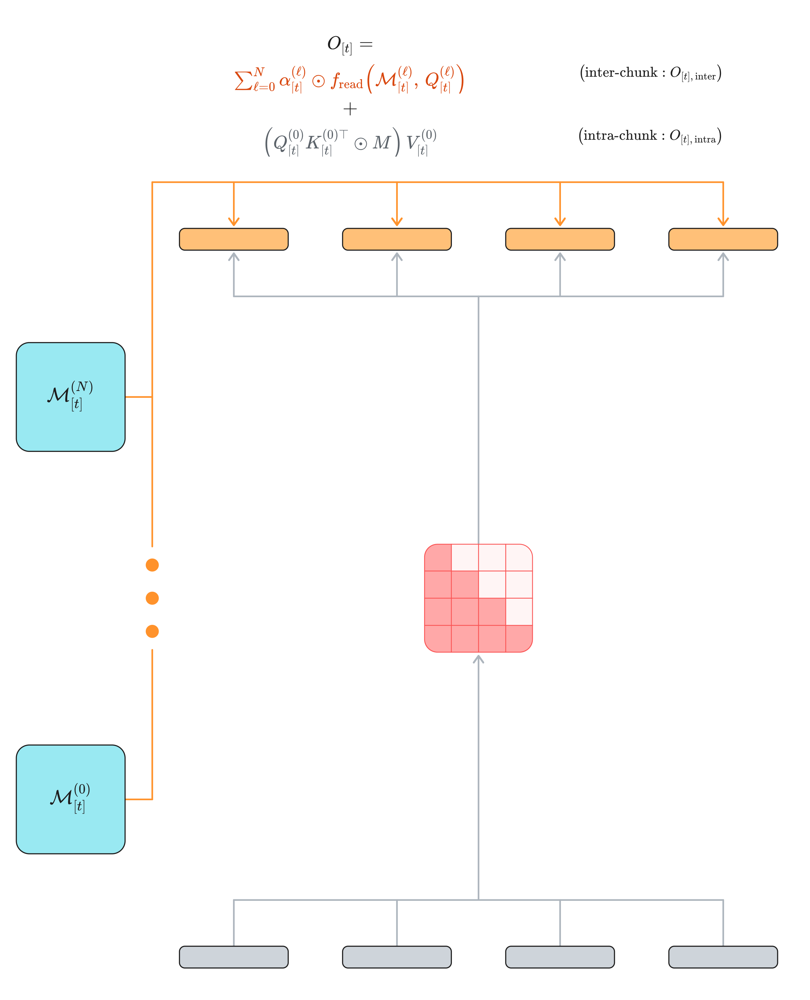

# Nested Recurrent Memory

**A framework for learned promotion across memory levels.** Work in progress.

For each layer of an RNN, maintain a chain of nested memory states. Each level performs
test-time regression on key-value pairs received from the level below, and each uses an
identical procedure to update its own memory from those pairs. Levels fire on an arbitrary
schedule, subject only to the constraint that each fires less frequently than the one below.

At the bottom of the chain, keys and values come from the current input. Higher levels use
learned, fixed-size query banks to extract values from the memory state at the next level
down, then derive learned write keys for the retrieved values. The extraction apparatus is
learned end-to-end, so the loss gradient at each token cascades through the entire chain of
memory consolidation — both through the memory states and through the operators that promote
information between levels. Higher levels can therefore preserve content that proves salient
downstream, protecting it from the decay and collision that would otherwise erase it below.

This repository contains a naive PyTorch implementation, instantiated as a Nested Gated
DeltaNet. Triton kernels and evaluations to follow.

  

<b>Chunkwise memory update.</b>

  

<b>Parallel output computation.</b>

Full write-up: [Nested Recurrent Memory](https://awehrs.io/posts/nested-recurrent-memory/)